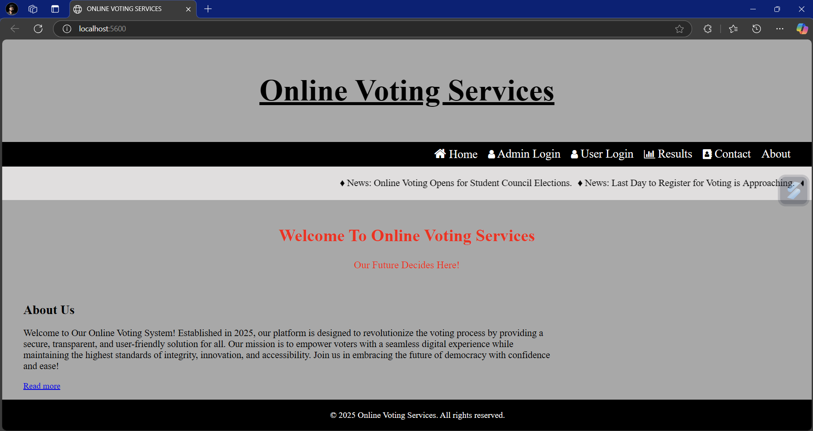

<!DOCTYPE html>
<html lang="en">
<head>
    <meta charset="UTF-8">
    <meta name="viewport" content="width=device-width, initial-scale=1.0">
</head>
<body>

<h1>🗳 Online Voting System</h1>

<h2>📌 Overview</h2>

The <b>Online Voting System</b> is a web-based application that allows voters to securely cast their votes in elections. The system ensures transparency, security, and efficiency by allowing registered users to vote based on their constituency. Admins can manage voter data, monitor election results, and remove invalid voters.

<h2>🏗 Features</h2>
<ul>
    <li><b>User Registration:</b> New users can create an account using their <b>EPIC ID, Aadhaar, Name, and Constituency</b>.</li>
    <li><b>Secure Login:</b> Both <b>Voters</b> and <b>Admins</b> can log in to their respective accounts.</li>
    <li><b>Voting System:</b> Registered users can cast their votes in their respective constituencies.</li>
    <li><b>Admin Panel:</b>
        <ul>
            <li>View and manage voter details.</li>
            <li>Remove invalid or duplicate voters.</li>
            <li>Monitor voting results in real time.</li>
        </ul>
    </li>
    <li><b>Result Declaration:</b> The system displays the election results based on selected constituencies.</li>
</ul>

<h2>🛠 Technologies Used</h2>
<ul>
    <li> HTML, CSS, JavaScript (Frontend)</li>
    <li> MySQL (Database)</li>
    <li> Bootstrap (UI Styling)</li>
    <li> Node.js (Backend)</li>
    <li> Express.js (Server Framework)</li>
    <li> JWT (Authentication)</li>
    <li> Bootstrap (UI Styling)</li>
</ul>

<h2>📸 Screenshots</h2>

<h3>🏠 Home Page</h3>

 

<h3>🔐 Admin Login</h3>

 

<h3>📋 Admin Dashboard</h3>

 

<h3>🔐 User Login</h3>

 

<h3>🗳 User Dashboard</h3>

 

<h3>🗳 Voting Page</h3>

 

<h3>📄 User Details Page</h3>

 

<h3>📝 Registration Page</h3>

 

<h3>📊 Election Results</h3>

 

<h2>🤝 Contributors</h2>
<ul>
    <li><b>Mr. Ajay Kumar Soma</b> - Developer</li>
</ul>

<h2>📜 License</h2>

<b>This project is licensed under the CC BY-NC 4.0 License. You may not use it for commercial purposes without permission.</b>

<h2>⚠️ Disclaimer</h2>

This application is designed for educational and experimental purposes. It should not be used in real-world elections without proper security measures.

</body>
</html>
